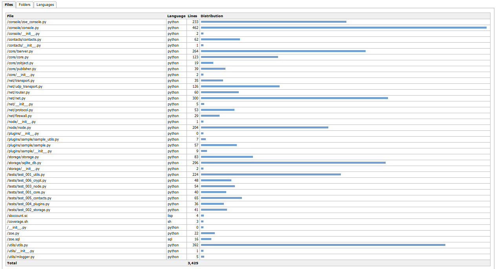
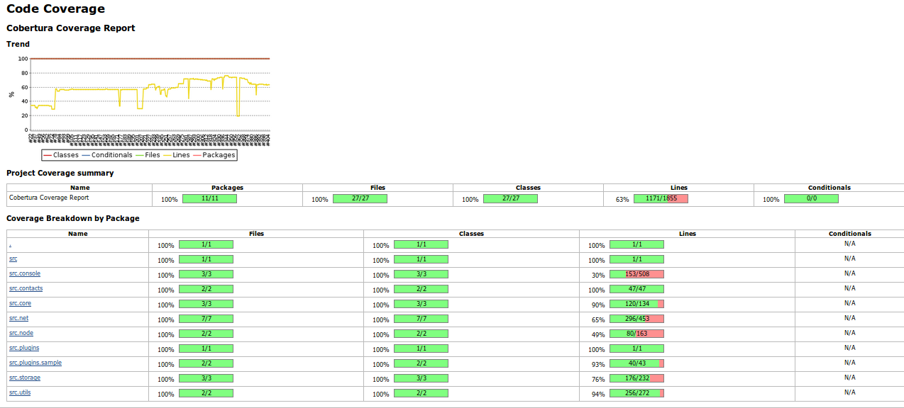
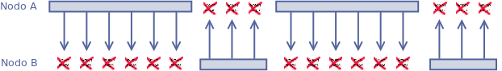
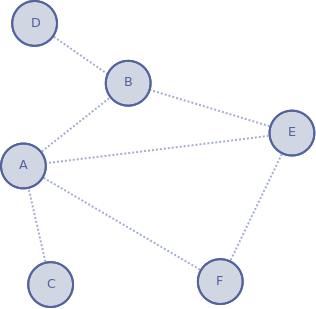
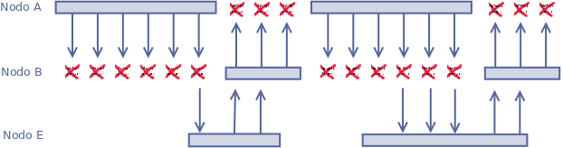
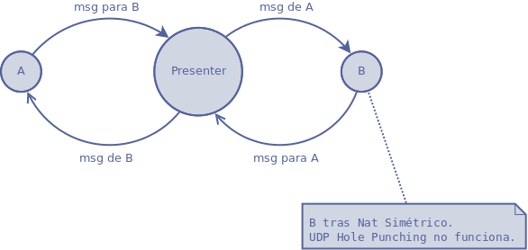
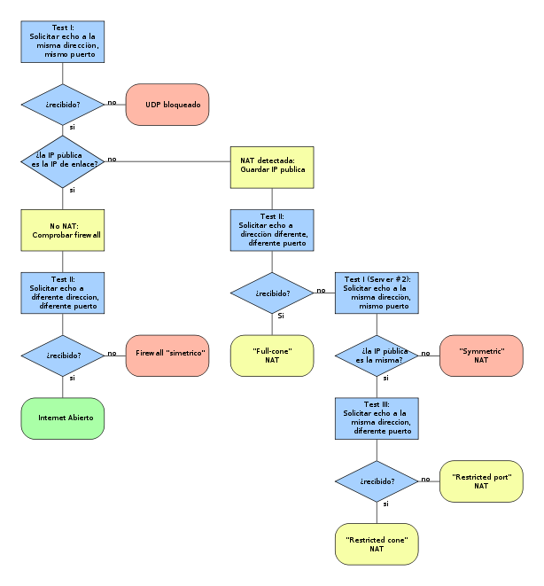

Estadísticas finales
--------------------

Número de builds: 407

Número de líneas: 3400

        Fig. :counter:`figure`: Líneas de código 

Grado de cobertura

        Fig. :counter:`figure`: Cobertura

Violaciones pylint: 9

.. page::

Problemas conocidos y soluciones propuestas
===========================================

Sobrecarga
----------

- Problema:

 El protocolo actualmente utilizado se basa en una sencilla serialización del objeto que 
 contiene toda la información del mensaje. Esto genera una importante sobrecarga en las
 cabeceras.

- Solución propuesta:

 Derivar un protocolo que utilice caberas binarias más eficientes.

- Problema:

 La única forma de encriptación soportada por el momento es una encriptación basada en
 claves asimétricas RSA donde los mensajes se encriptan con la clave pública del
 receptor y se firman con la clave privada del emisor. Esto genera una gran sobrecarga
 para mensajes pequeños.

- Solución propuesta:

 Negociar una clave AES una vez que los nodos son "amigos", utilizando sus claves RSA
 y encriptar, en adelante, con AES.

Ventana de transmisión
----------------------

- Problema:

 ZOE es un sistema de mensajes F2F. En la implementación actual, un mensade de A para B
 sólo puede prosperar si A y B están operativos al mismo tiempo. Esto implica que si
 no coinciden operativos en algún momento, los mensajes nunca prosperarán.

|

        Fig. :counter:`figure`: No hay ventana de transmisión

|

- Solución propuesta:

 Como solución a esto se propone que se utilicen otros nodos de la red de confianza
 como colaboradores, de manera que puedan hacer de "puente" entre otros nodos.

 En red de contactos como la siguiente, si cada mensaje se forwardea a otros contactos
 - encriptado, por supuesto - , además del destinatario legítimo, para que estos
 intenten enviárselo a su vez, se amplía la posibilidad de tener ventana de transmisión.

        Fig. :counter:`figure`: Red donde los nodos se ayudan a transmitir los mensajes.

|

        Fig. :counter:`figure`: No hay ventana de transmisión

|

 En este contexto, A enviaría el mensaje para B no sólo a B, sino a todos los nodos
 que acepten colaborar con él que intentarán, a su vez, hacer llegar el mensaje a B.

 Los nodos intermedios no deben poder acceder al contenido de esos mensajes, por lo
 que deberán ir encriptados.

 Se deben implementar estrategias para evitar inundación y bucles.

 Para evitar bucles, un nodo no debe procesar un mensaje cuyo **mid** ya ha sido procesado. 

 Para evitar inundación, los mensajes deben incorporar dos indicadores:

 - JTL: Jumps To Live, o cuantos saltos en profundidad pueden alcanzar.

 - NTS: Nodes to Spread, o a cuantos nodos se "forwardea" el mensaje.

.. page::

Consola insegura
----------------

- Problema:

 En la implementación actual, la comunicación TCP a través de la consola es plana. Esto, si
 se utiliza desde el mismo equipo, podría no suponer ningún problema de seguridad, pero
 si se explota desde otro equipo o, peor, desde internet, la comunicación podría ser
 comprometida.

 Esto podría resolverse mediante el acceso a través de un canal seguro, como un tunel
 SSH, pero es algo que queda fuera del alcance del usuario normal.

- Solución propuesta:

 Extender la consola telnet para que soporte conexiones SSL.

.. page::

Nodos no se conectan tras Nats simétricos
-----------------------------------------

- Problema:

  Udp Hole Punching se basa en que, una vez que un nodo se ha publicado en un Presentador,
  este comunica su dirección vista en el datagrama ( IP:Puerto ) a los nodos que quieran
  conectarse con él.

  Si B está tras un Nat Simétrico, su router sólo admitirá de vuelta paquetes que provengan
  de la IP del presentador, pero no de terceros.

- Solución propuesta:

  Ampliar la funcionalidad de los nodos para que puedan comportarse como "relays" entre nodos,
  de la misma manera que hacen los servidores en la red eMule [#emule]_ entre nodos
  que no son accesibles.

  Esto implica que se debe utilizar un servidor Stun [#stun]_  para determinar si un nodo
  está tras un Nat asimétrico y debe utlizarse relay para poder comunicarse con él.

|
|
|
|

        Fig. :counter:`figure`: Comunicacion con nodo tras Nat Simetrico.

        Fig. :counter:`figure`: Protocolo Stun. Fuente: http://es.wikipedia.org/wiki/STUN

.. [#stun] `Stun RFC-5389 <http://tools.ietf.org/pdf/rfc5389.pdf>`
.. [#emule] `eMule Protocol <http://www.cs.huji.ac.il/labs/danss/p2p/resources/emule.pdf>`

.. page::

Bugs conocidos
==============

**Bug.001**

 - Error: Al parar la aplicación no se detienen todos los procesos
 - Reproducibilidad: Baja: Ocurre esporádicamente 
 - Causa presumible: Algún thread no se detiene

.. page::

.. include:: conclusiones.rst

.. page::

Trabajos futuros
================

Este trabajo constituye, tan solo, una versión funcional de un "core" que 
proporciona mensajería encriptada entre dos nodos F2F.

Si bien cumple con su objetivo: "Poder enviar un mensaje encriptado de A
a B, sin que este pase por ningún servidor", es necesario, para que sea
utilizable en el mundo "real", dotarle de algunas características adicionales.

Algunas de las estas características son:

Instalador
----------

En este trabajo no se ha desarrollado un instalador para usuarios finales.

Eso implica que, actualmente, el usuario deba instalar python en su equipo
si no lo tuviera ya y las librarías de python necesarias.

Debería prepararse un instalador típico que con unos sencillos pasos
instalaran todo lo necesario para que el nodo fuera operativo.

GUI(s)
------

Desde el principio, este trabajo se centró en la parte de lógica y se descartó
realizar ningún GUI. 

En futuros trabajos, podrían escribirse GUIs de usuario, para que sea realmente
utilizable por usuarios finales que no están acostumbrados -ni quieren- una
austera consola en modo comando.

Dichos GUIs pueden realizarse en cualquier lenguaje explotando el acceso telnet
o mediante plugins en python.

Aplicaciones sobre Zoe
----------------------

ZOE soporta un soporte básico que resuelve la comunicación privada F2F entre
nodos. 

A partir de aquí se podría extender o usar como core para otras aplicaciones y
ofrecer funcionalidades atractivas como:

- Gestión de Grupos
- Presentación de estado y avatar selectivo,
- Compartición y búsqueda de ficheros,
- Backups colaborativos,
- Almacenamiento distribuido, 
- Una red social de confianza,
- etc

NetBLT
------

En la versión actual, por cada mensaje con garantía enviado, se requiere un 
ACK por parte del receptor y no es eficiente.

El objetivo del presente trabajo no es ser eficiente, pero en futuras ampliaciones
o extensiones, sería interesante dotarle de un mejor rendimiento para poder,
por ejemplo, intercambiar streamings de vídeo o audio ...

Esto se puede conseguir mediante la utlización de NetBLT [#netblt]_.

NetBLT ( Network Block Transfer ) es un protocolo en la capa de transporte
diseñado para la transmisión rápida de gran cantidad de información 
entre ordenadores. 

Proporciona una transferencia que es fiable y con control de flujo y
está diseñado para proporcionar el máximo throughput sobre una amplia
variedad de redes.

Si bien NetBLT actualmente funciona sobre IP, debería ser capaz de 
funcionar con cualquier protocolo de datagramas. 

A grandes rasgos, en NetBLT, todos los mensajes se encolan en un streaming
de salida y se envían chunks de datos con cierto número de bloques en cada
chunk. Un mensaje no tiene por qué estar completo en un chunk. La comunicación
se comporta como un streaming, aunque no lo fuera.

La sobrecarga por acks se minimiza enviando cada cierto tiempo un buffer con 
máscaras a nivel de bit por cada bloque del chunk. De esta forma, cada extremo
envía, cada cierto tiempo, por ejemplo, un buffer de 1Kb con 1024 bits, suponiendo
que los chunks fueran de 1024 bloques.

Cada extremo envía entonces sólo los bloques que falten en el otro extremo.

Ref. `NetBLT rfc-998- <http://tools.ietf.org/pdf/rfc998.pdf>`

.. [#netblt] `NetBLT rfc-998- <http://tools.ietf.org/pdf/rfc998.pdf>`

