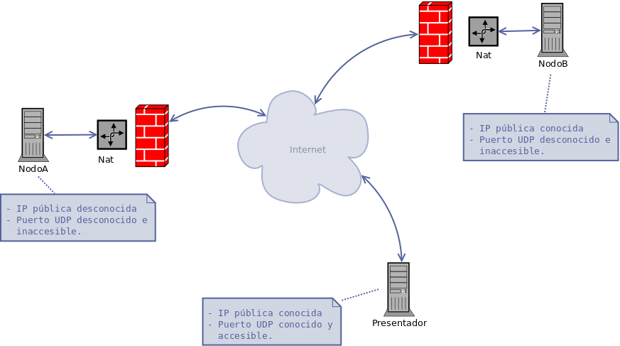
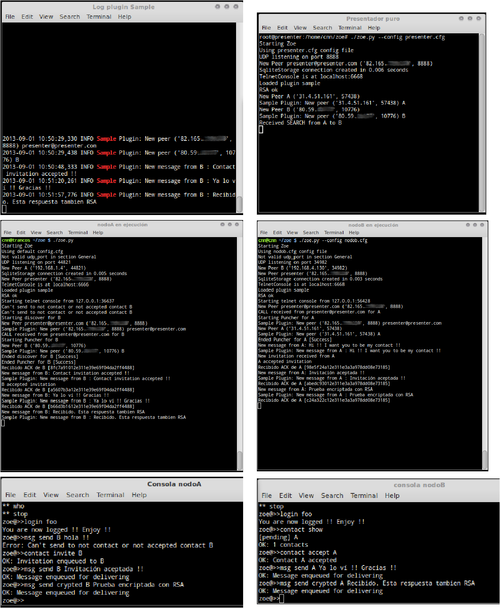

Anexo 1. Zoe en ejecución
-------------------------

A continuación se mostrarán unas capturas de pantalla de Zoe en ejecución
se comentarán las trazas de cada nodo.

La topología desplegada para este ensayo es:

**NodoA:**

Nodo en Linux Mint, utilizando conexión a internet mediante un router 3G.
Tanto la IP pública como el puerto UDP donde escucha Zoe son desconocidos
y en todo caso, el router rechazaría los paquetes dirigidos a su dirección
interna.

**NodoB:**

Nodo en Linux Debian, utilizando conexión a internet mediante gateway
empresarial. La IP pública es conocida, pero no el puerto UDP que expondrá
el router. Aún sabiéndose, cualquier paquete UDP dirigido a la dirección
pública expuesta sería rechazado por tratarse de un Nat Cono de puerto 
retringido.

**Presentador**

Nodo en Linux Debian, en hosting en internet cuya IP y puerto expuesto
son conocidos y accesibles.

|
|
|

   Fig. :counter:`figure`: Topología ensayo.

.. page::

   Fig. :counter:`figure`: Capturas de pantalla Zoe en ejecución

Nodo A
*******

::

 01 >> cnn@trancos ~/zoe $ ./zoe.py 
      Starting Zoe

      Arranque del nodo con fichero de configuración por defecto

 02 >> Using default config.cfg

 03 >> Not valid udp_port in section General

 04 >> UDP listening on port 44821

      A no especifica puerto UDP local, por lo que el operativo le asigna uno.

 04 >> New Peer A ('192.168.1.4', 44821)

      El nodo se autopublica en la lista de nodos conocidos

 06 >> SqliteStorage connection created in 0.005 seconds

      Arranque del storage

 07 >> New Peer presenter ('82.165.XXX.XXX', 8888)

      Registro de nodos bien conocidos

 08 >> TelnetConsole is at localhost:6666

      Arranque de consola telnet y puerto de escucha

 09 >> Loaded plugin sample

      Carga de plugins

 10 >> RSA ok

      Comprobación de claves RSA. Si no existieran, se crearían.

 11 >> Starting telnet console from 127.0.0.1:36637

      Conexión a la consola telnet (consolaA, línea 01)

 12 >> Can't send to not contact or not accepted contact B

 13 >> Can't send to not contact or not accepted contact B

      Intento de enviar un mensaje a un contacto inexistente o 
      no aceptado ( consolaA, línea 03 )

 14 >> Starting discover for B

      Iniciado discover para B, como resultado de consolaA, línea 04.

 15 >> New Peer presenter@presenter.com ('82.165.XXX.XXX', 8888)

 16 >> Sample Plugin: New peer ('82.165.XXX.XXX', 8888) presenter@presenter.com

 17 >> CALL received from presenter@presenter.com for B

      Respuesta de presenter pidiéndole que "llame" a B a la dirección
      ('80.59.YYY.YYY', 10776) y las privadas publicadas.

 18 >> Starting Puncher for B

      Inicio de "punching" contra B a sus direcciones.

 19 >> New Peer B ('80.59.YYY.YYY', 10776)

      Recibido paquete de B desde su dirección pública.

 20 >> Sample Plugin: New peer ('80.59.YYY.YYY', 10776) B

      El plugin ejemplo, que está subscrito a notificaciones
      de new_peer es notificado

 21 >> Ended discover for B [Success]

 22 >> Ended Puncher for B [Success]

      Tanto el discover como el punch terminan con éxito.

 23 >> Recibido ACK de B [8fc7a91012e311e39e69f04da2ff4488]

      Recibido ack de B respecto a invitación generada en
      consolaA, linea 04

 24 >> New message from B: Contact invitation accepted !!

      Recibida aceptación de invitación ( consolaB, línea 04 )

 25 >> Sample Plugin: New message from B : Contact invitation accepted !!

      El plugin de ejemplo también está subscrito a new_message/ por lo 
      que es notificado.

 26 >> B accepted invitation

 27 >> Recibido ACK de B [a5607b3a12e311e39e69f04da2ff4488]

      Ack de mensaje enviado en consolaA, línea 05

 28 >> New message from B: Ya lo ví !! Gracias !!

      Mensaje de B ( consolaB, línea 05)

 29 >> Sample Plugin: New message from B : Ya lo ví !! Gracias !!

      Plugin de ejemplo es notificado
 
 30 >> Recibido ACK de B [b66d3b1612e311e39e69f04da2ff4488]

      Ack de mensaje enviado consolaA, línea 06

 31 >> New message from B: Recibido. Esta respuesta tambien RSA

      Mensaje recibido ( consolaB, línea 06 )

 32 >> Sample Plugin: New message from B : Recibido. Esta respuesta tambien RSA

      Plugin es notificado

Consola A
*********

::

 01 >> cnn@trancos ~/zoe $ rlwrap telnet localhost 6666

 Telnet a la consola. Responde con mensaje de bienvenida y
 ayuda general.

      Trying 127.0.0.1...
      Connected to localhost.
      Escape character is '^]'.
      
      Wellcome to zoe console. cnn 2013
      ---------------------------------------------

      TIP: write 'help' for help
      TIP: in linux, if you use 'rlwrap telnet <host> <port>',
           you will have arrows history in your telnet session !!

      Enjoy !!
      
      Available commands. Type 'help <command>' for specific help.

       info
       quit
       sample
       contact
       help
       sql
       msg
       login
       who
       stop

    
 02>>  zoe@>>login foo
      You are now logged !! Enjoy !!

 El usuario se loga. Antes no puede hacer uso de las funcionalidades
 de la consola

 03>>  zoe@>>msg send B hola !!
      Error: Can't send to not contact or not accepted contact B

 Envío de mensaje a nodo desconocido o no aceptado. El sistema no 
 lo permite ( nodoA, línea 12)

 04>>  zoe@>>contact invite B
      OK: Invitation enqueued to B

 Envío de invitación a B

 05>>  zoe@>>msg send B Invitación aceptada !!
      OK: Message enqueued for delivering

 Envío de mensaje plano a B

 06->> zoe@>>msg send crypted B Prueba encriptada con RSA
      OK: Message enqueued for delivering

 Envío de mensaje encriptado a B

Nodo B
******

::

 01 >> cnn@cnn ~/zoe $ ./zoe.py --config nodob.cfg
 02 >> Starting Zoe
 03 >> Using nodob.cfg config file

     Ejecución con fichero de config

 04 >> Not valid udp_port in section General
 05 >> UDP listening on port 34982

     No se especifica puerto UDP en config por lo
     que el operativo asigna uno

 06 >> New Peer B ('192.168.4.130', 34982)

     Autopublicación en nodos conocidos

 02 >> New Peer presenter ('82.165.XXX.XXX', 8888)

     Registro de presentador

 02 >> SqliteStorage connection created in 0.003 seconds

     Arrancado storage

 02 >> TelnetConsole is at localhost:6668

     Arrancada consola en puerto 6668

 02 >> Loaded plugin sample

     Plugins cargados

 07 >> RSA ok

     Comprobación de claves RSA

 08 >> Starting telnet console from 127.0.0.1:56428

     Iniciada consola telnet

 09 >> New Peer presenter@presenter.com ('82.165.XXX.XXX', 8888)
 10 >> CALL received from presenter@presenter.com for A

     Recibido CALL del presentador para A como resultado de 
     consolaA, línea 04

 11 >> Starting Puncher for A
 
     Iniciado punch contra direcciones de A

 12 >> Sample Plugin: New peer ('82.165.XXX.XXX', 8888) presenter@presenter.com

     Sample de B registra nombre desconocido del presentador

 13 >> New Peer A ('31.4.51.161', 57438)

     B recibe HEL de A

 14 >> Sample Plugin: New peer ('31.4.51.161', 57438) A

     El plugin sample de B es notificado

 15 >> Ended Puncher for A [Success]

     Punch contra A terminado con éxito

 16 >> New message from A: Hi !! I want you to be my contact !!

     Mensaje de invitación de A ( consolaA, línea 04)

 17 >> Sample Plugin: New message from A : Hi !! I want you to be my contact !!

     Plugin de B es notificado

 18 >> New invitation received from A

     Invitación recibida

 19 >> A accepted invitation

     Invitación de A aceptada 

 20 >> Recibido ACK de A [98e5f24a12e311e3a3a978dd08e73185]

     Ack a mensaje de aceptación 

 21 >> New message from A: Invitación aceptada !!

     Mensaje plano de A ( consola A, línea 05)

 22 >> Sample Plugin: New message from A : Invitación aceptada !!

     Plugin Sample de B es notificado

 23 >> Recibido ACK de A [abedc93012e311e3a3a978dd08e73185]

     Ack de A para mensaje ConsolaB, línea 05

 24 >> New message from A: Prueba encriptada con RSA

     Mensaje de A encriptado

 25 >> Sample Plugin: New message from A : Prueba encriptada con RSA

     Plugin es notificado

 26 >> Recibido ACK de A [c24a322c12e311e3a3a978dd08e73185]

     Ack para mensaje ConsolaB, línea 06

Consola B
*********

::

 01 >> cnn ~ # rlwrap telnet localhost 6668

   Telnet a la consola

      Trying 127.0.0.1...
      Connected to localhost.
      Escape character is '^]'.
      ***********************************************************
      Wellcome to zoe console. cnn 2013
      ---------------------------------------------

      TIP: write 'help' for help
      TIP: in linux, if you use 'rlwrap telnet <host> <port>',
           you will have arrows history in your telnet session !!

      Enjoy !!
      ***********************************************************
      Available commands. Type 'help <command>' for specific help.

      ** info
      ** quit
      ** sample
      ** contact
      ** help
      ** sql
      ** msg
      ** login
      ** who
      ** stop

 02 >> zoe@>>login foo
      You are now logged !! Enjoy !!

 03 >> zoe@>>contact show
      [pending] A
      OK: 1 contacts

   Muestra los contactos actuales

 04 >> zoe@>>contact accept A
      OK: Contact A accepted

   Acepta la solicitud de contacto de A

 05 >> zoe@>>msg send A Ya lo ví !! Gracias !!
      OK: Message enqueued for delivering

   Mensaje plano para A

 06 >> zoe@>>msg send crypted A Recibido. Esta respuesta tambien RSA
      OK: Message enqueued for delivering

   Mensaje encriptado para A

Sample Plugin A
****************

::

 01 >> 2013-09-01 10:50:29,330 INFO Sample Plugin: New peer ('82.165.XXX.XXX', 8888) presenter@presenter.com

  Notificación de presentador

 02 >> 2013-09-01 10:50:29,438 INFO Sample Plugin: New peer ('80.59.YYY.YYY', 10776) B

  Notificación de nuevo peer B

 03 >> 2013-09-01 10:50:48,333 INFO Sample Plugin: New message from B : Contact invitation accepted !!

  Notificación de mensaje

 04 >> 2013-09-01 10:51:20,261 INFO Sample Plugin: New message from B : Ya lo ví !! Gracias !!

  Notificación de mensaje

 05 >> 2013-09-01 10:51:57,776 INFO Sample Plugin: New message from B : Recibido. Esta respuesta tambien RSA

  Notificación de mensaje

Presentador
****************

::

 01 >> root@presenter:/home/cnn/zoe# ./zoe.py --config presenter.cfg 

  Arranque indicando fichero de configuración

 02 >> Starting Zoe
 03 >> Using presenter.cfg config file
 04 >> UDP listening on port 8888

  Se utiliza el puerto UDP indicado en configuración. Este puerto
  debe ser accesible y conocido.

 05 >> New Peer presenter@presenter.com ('82.165.XXX.XXX', 8888)

  Autoregistro en nodos conocidos

 06 >> SqliteStorage connection created in 0.006 seconds

  Arranque storage

 07 >> TelnetConsole is at localhost:6668

  Arranque de consola en puerto tcp:6668

 08 >> Loaded plugin sample

  Cargados plugins

 09 >> RSA ok

  Comprobación de claves RSA

 10 >> New Peer A ('31.4.51.161', 57438)

  Registrado nodo A

 11 >> Sample Plugin: New peer ('31.4.51.161', 57438) A

  Notificación a plugin

 12 >> New Peer B ('80.59.YYY.YYY', 10776)

  Registrado nodo B

 13 >> Sample Plugin: New peer ('80.59.YYY.YYY', 10776) B

  Notificación a plugin

 14 >> Received SEARCH from A to B

  Recibido SEA de A por B. El presentador envía sendos
  CALL a cada uno de ellos con las direcciones del contrario.

