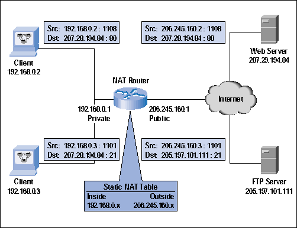
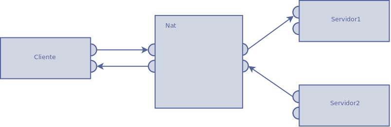
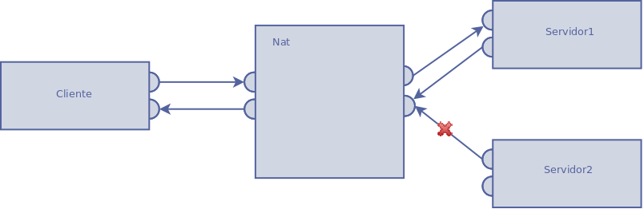
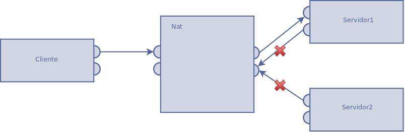
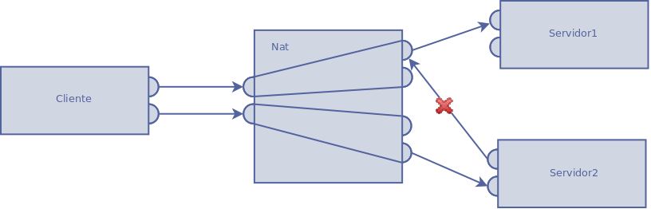

Fundamentos técnicos
====================

El problema de las comunicaciones P2P es que, al menos, uno de los extremos a comunicar
debe ser accesible en IP y puerto.

La solución obvia, es que uno de los extremos tenga una IP pública y los puertos necesarios
accesibles. Dicha IP pública, en principio, debería ser fija o, al menos, resolvible por
DNS usando cualquier proveedor de dyndns, de manera si cambia la IP pública, inmediatamente
se propaga el cambio en los DNS del mundo.

Los usuarios, en sus casas y dispositivos móviles tienen una IP pública, bien fija bien
dinámica.

En los hogares, podrían configurar reglas de NAT en su ruter, que suelen permitirlo,
para que los paquetes alcanzaran el dispositivo interno.

En los dispositivos móviles con conexión directa de datos, los puertos estarán abiertos en función del operativo
y operador.

En ambientes empresariales, o en entornos wifi, los equipos de los usuarios son, en principio,
inaccesibles. No es fácil que un administrador enrute el tráfico de nuestra aplicación
favorita a nuestra ip: puerto internos ....

Y esto se debe al uso de enmascaramiento para acceder a internet.

Es enmascaramiento es una técnica utilizada para poder tener muchos equipos internos accediendo
a internet ( o en cualquier caso, a otra red ), con una sóla IP pública. Esto se hace así
ya que las IPs públicas son escaras y escasas ... en IPv4 [#_ipv4]_sólo hay 2^32 IPs públicas,
muchas de las cuales corresponden a redes privadas y aunque sean más de 4000 millones,
grandes corporaciones y paises acaparan grandes segmentos del espacio de direcciones.

Con enmascaramiento, los dispositivos gateway tienen unas tablas donde identifican ips internas
y puertos internos. Cuando llega un paquete de internet y otra red, el dispositivo enmascarador
deshace el enmascaramiento y reenvía en contenido a la ip interna: puerto interno.

Quizás algún día, cuando IPV6[#ipv6]_ se estandarice, cada equipo electrónico del mundo podrá
tener una IP pública ...

IPv6 admite 340.282.366.920.938.463.463.374.607.431.768.211.456 (2^128 o 340 sextillones de direcciones),
lo que supone que en una población mundial de 7.000 millones de personas, cada una de ellas
podría tener 4.8×10^28 direcciones públicas !!

.. [#ipv4] `IPv4 <rfc-791 http://tools.ietf.org/pdf/rfc791.pdf>` 
.. [#ipv6] `IPv6 <frc-2460 http://tools.ietf.org/pdf/rfc2460.pdf>` 

En tanto cada persona tengamos 4.8*10^28 is públicas para nuestros dispositivos, 
gracias al comportamiento de los NATs, es posible implementar la técnica UDP Hole Punching para
establecer conexiones P2P entre equipos con IPs privadas y puertos desconocidos.

.. page::

NAT
---
.. class:: table-cita:

 "NAT (Network Address Translation - Traducción de Dirección de Red) es un mecanismo utilizado 
 por routers IP para intercambiar paquetes entre dos redes que asignan mutuamente direcciones incompatibles. 
 Consiste en convertir, en tiempo real, las direcciones utilizadas en los paquetes transportados. 
 También es necesario editar los paquetes para permitir la operación de protocolos que incluyen 
 información de direcciones dentro de la conversación del protocolo. [#nat]_"

.. [#rfc4787] `Nat rfc-4787 <http://tools.ietf.org/pdf/rfc4787.pdf>`
.. [#nat] http://es.wikipedia.org/wiki/Network_Address_Translation
.. [#nat.imagen] http://www.monografias.com/trabajos20/traductor-nat/traductor-nat.shtml

|
|
|

        Fig. :counter:`figure`: Nat

.. page::

Tipos de NAT
************

Full Cone NAT
.............

 Todos los paquetes de la misma dirección y mismo puerto internos son mapeadas a la misma dirección 
 y mismo puerto externo. Cualquier host externo puede mandar un paquete al host interno mandandolo 
 a la dirección y el puerto externo que ha sido mapeado. Se conoce como también 
 como "one-to-one NAT". (NAT uno a uno).

        Fig. :counter:`figure`: Full Cone Nat

Restricted cone NAT 
...................

 Todos los paquetes de la misma dirección y mismo puerto internos son mapeadas a la misma dirección 
 y mismo puerto externo. En este caso, en contraposición con full cone NAT, un host externo 
 (con IP x.x.x.x) sólo puede mandar un paquete al host interno si previamente el host interno 
 le había enviado un paquete a la dirección IP x.x.x.x.

        Fig. :counter:`figure`: Restricted Cone Map

Port-restricted cone NAT
........................

  Es como restricted cone NAT, pero la restricción incluye también numeros de puerto. 
  Un host externo (con IP x.x.x.x y puerto P) sólo puede mandar un paquete al host 
  interno si previamente el host interno le había enviado un paquete a la dirección IP x.x.x.x y puerto P.

        Fig. :counter:`figure`: Cone-Restricted Cone Nat

.. page::

Symmetric NAT 
.............

  Es NAT donde todas las peticiones de la misma IP y puerto interno con destino a otra 
  IP y su correspondiente puerto son mapeadas en el router con la misma IP y puerto. Si el 
  mismo host interno manda un paquete con la misma dirección interna y puerto a 
  un destino diferente se usará un mapeo diferente. Sólo el host externo que recibe un 
  paquete puede mandar un paquete UDP de vuelta al host interno.

        Fig. :counter:`figure`: Symmectric Nat

.. page::

UDP Hole Punching
-----------------

La lectura de un artículo [#articulo_punching]_ sobre la técnica UDP Hole Punching [#punching]_ supuso
la inspiración para la realización de este trabajo.

Medienta esta técnica, se pueden conectar, mediante sockets UDP, equipos que están tras firewalles y
nats, inaccesibles desde internet directamente, gracias a las características de los elementos
de Nat.

.. class:: table-cita:

 "UDP hole punching relies on
 well-established NAT conventions to allow appropriately designed
 peer-to-peer applications to "punch holes" through NATs and firewalls
 and establish direct connectivity with each other, even when both
 communicating hosts may lie behind a NAT." [#articulo_punching]_

Muchas redes usan NAT. Esto permite a sistemas en la misma red compartir
una misma IP pública, además de que supone una mejora en la seguridad.

Pero estas ventajas de NAT implica que se produzcan complicaciones a la hora
de establecer conexiones P2P. 

UDP Hole punching es técnica muy conocida para establecer conexiones P2P
entre dispositivos que se encuentra tras NATs. El nombre de "Hole Punching"
se debe a que lo que hace es que practica un "agujero" en el firewall
de la red que permite que los paquetes provenientes de internet alcancen
el equipo destino.

Esta técnica funciona, atravesando cortafuegos y Nats para todos los tipos de NAT excepto
para el Nat Simétrico [#nat_simetrico]_ , donde los paquetes de vuelta sólo se 
permiten de la dirección original inicialmente conectada. 

Si bien, en principio, parecía que era imprescindible el uso de un tercer
equipo -Presentador-, localizado y accesible en internet, recientes investigaciones
apuntan una forma de poder prescindir del tercer equipo [#hole_punching_infosec]_,
si bien la puesta en práctica de lo propuesto en este "paper", queda fuera
del alcance de este trabajo y propuesto para futuras ampliaciones o extensiones.

En todo caso, la técnica utilizada para prescindir del presentador requiere que
las IPs del nodo a conectar sea conocida por el nodo que establece la conexión. Además,
los paquetes ICMP en los que se basa, podrían ser rechazados, por lo que puede no
funcionar en todas las ocasiones.

.. [#punching_paper] Peer to Peer communication across Nework 
   Address Translators`<http://pdos.csail.mit.edu/papers/p2pnat.pdf>`
.. [#articulo_punching] http://pdos.csail.mit.edu/~baford/nat/draft-ford-natp2p-00.txt
.. [#nat_simetrico] http://en.wikipedia.org/wiki/Network_address_translation#Types_of_NAT
.. [#hole_punching_infosec] http://resources.infosecinstitute.com/udp-hole-punching/
.. [#autonomous_punching] http://grothoff.org/christian/pwnat.pdf

